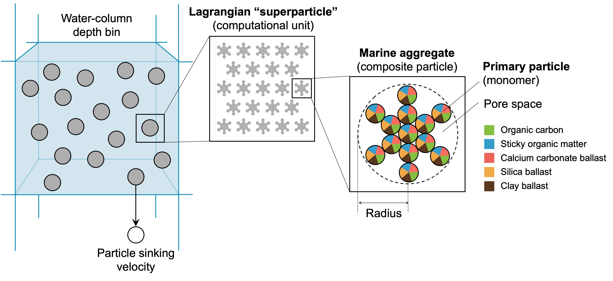
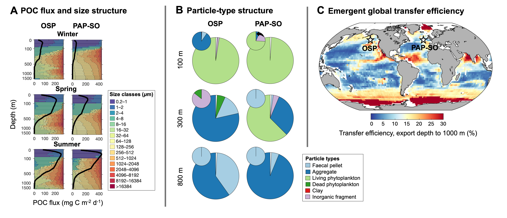

[](https://doi.org/10.5281/zenodo.22832464)

# SLAMS



SLAMS v2.0.0 (**Stochastic, Lagrangian Aggregate Model of Sinking particles**) is a fast, modular Fortran 90 particle-tracking model designed to simulate biogenic marine particle attributes and their dynamics in the ocean's biological carbon pump. 

> [!TIP]
>
> **🤝 Interested in using or extending SLAMS?**
>
> I welcome collaboration on applications involving the biological carbon pump
> and on model extensions addressing new scientific questions.
>
> As the model developer, I can offer guidance on model structure, forcing,
> parameterisation, configuration, and output interpretation.
>
> 📬 **Email** Anna Rufas at Anna.RufasBlanco@earth.ox.ac.uk

## Key Features

- Stochastic Lagrangian particle-resolving framework
- Super-Droplet Method ([Shima et al., 2009](https://doi.org/10.1002/qj.441)) for efficient resolution of particle interaction dynamics
- Physically grounded particle evolution via fractal scaling and Reynolds-number-dependent settling
- Explicit resolution of aggregation, fragmentation, and zooplankton-mediated repackaging
- Particle fluxes and size spectra emerge diagnostically from explicit depth crossings
- One-dimensional water-column framework scalable to global grids via independent column execution
- Modular Fortran 90 core with Bash workflow control and MATLAB analysis tools

## Architecture

SLAMS adopts a layered architecture separating scientific computation from workflow control:
1. Model layer (**Fortran 90**)
   - Core SLAMS simulation engine
   - Reads binary forcing files
   - Scientific parameters configurable via `namelist`
2. Workflow orchestration layer (**Bash**)
   - Environment initialisation
   - Compilation
   - Forcing management
   - SLURM job submission with scalable job arrays
   - Experiment orchestration
3. Pre/post-processing layer (**MATLAB**)
   - Converts `.mat` forcing datasets into model-ready `.bin` inputs
   - Aggregates model output into `.mat` files
   - Computes derived diagnostics (e.g., biological pump metrics)

## Requirements

### Core model

- Fortran compiler (`ifort` or `gfortran`)
- Unix-like environment (Linux or macOS); HPC recommended for large or multi-column simulations
- [SLURM](https://slurm.schedmd.com/overview.html) workload manager (recommended for large ensemble or global simulations)

### Pre- and post-processing

- [MATLAB](https://mathworks.com/products/matlab.html) (R2021a or later)

### Optional MATLAB toolboxes

- Parallel Computing Toolbox (optional; used to accelerate bootstrap uncertainty calculations for BCP metrics. All routines run in serial mode if unavailable.)

### Third-party MATLAB utilities

The following packages from [MATLAB's File Exchange](https://mathworks.com/matlabcentral/fileexchange/) are required and should be added to the MATLAB path: `m_map`, `brewermap`, `subaxis`.

### Computing environment

The SLAMS v2.0.0 workflow was developed and tested using the University of Oxford Advanced Research Computing (ARC) HPC environment. Exact compiler, MATLAB, MKL, and module versions are specified in the workflow scripts.

The workflow can also be adapted for other HPC systems or local machines, but module names, paths, resource limits, and available software may need to be changed.

## Forcing Data

### Quick route: prepared forcing files

For convenience, the prepared gridded forcing files used by the example configuration are available as a versioned Zenodo dataset:

- [SLAMS v2.0.0 forcing dataset](https://doi.org/10.5281/zenodo.22770019)

Download and extract the archive into the `data/raw/` directory.

### Full route: reconstructing the forcing data

The example configuration included in this repository was built using the following data products:

- Surface photosynthetic active radiation – NASA Aqua-MODIS sensor
- Net primary production (NPP) – BICEP project
- Chlorophyll *a* – ESA OC-CCI merged-sensor product
- Temperature, salinity, nutrients, dissolved oxygen – World Ocean Atlas 2023 (WOA23) 
- Aeolian dust flux – CMIP6/NCAR-CESM2
- Mesozooplankton biomass – CMIP6/PISCES
- Mixed layer depth – IFREMER
- Seawater density – calculated from WOA23 using GSW Oceanographic Toolbox
- Seawater dynamic viscosity – calculated from WOA23 using MIT seawater properties library routines
- Calcite saturation state – calculated using CO2SYS

Data download, formatting, and gap-filling tools are available in the following GitHub repositories:

 - [ocean-data-lab](https://github.com/annarufas/ocean-data-lab)
 - [gap-filling-methods-ocean-data](https://github.com/annarufas/gap-filling-methods-ocean-data)

These tools convert raw NetCDF products into the `.mat` files required by SLAMS.

## Quick Start

These instructions apply to SLAMS v2.0.0.

Before starting, download the [SLAMS v2.0.0 forcing dataset](https://doi.org/10.5281/zenodo.22770019) and extract it into `data/raw/`.

In the instructions below, the placeholder `MYRUN` represents the name of your SLAMS experiment. Replace `MYRUN` consistently with the same name in all commands, configuration filenames, and generated directories. For example, if your experiment is called `LOCALTS6`, use:

- `config/namelist_LOCALTS6.txt`
- `config/config_latitudes_LOCALTS6.txt`
- `config/config_longitudes_LOCALTS6.txt`
- `tests/LOCALTS6/`

Importantly, do not use spaces in the experiment name.

The steps below must be run sequentially. Wait for all jobs submitted by one step
to finish successfully before starting the next step.

The pipeline scripts can be run directly on a local machine or submitted to SLURM. Each script contains further instructions for the relevant execution mode.

### Step 1 - Create an experiment configuration

**1.1 Copy the namelist template**

```bash
cp ./config/namelist_template.txt ./config/namelist_MYRUN.txt
```
Replace `MYRUN` with your experiment name. 

**1.2 Choose the grid type**

Edit your new namelist and set:
```
CHOICE_GRID_DOMAIN=2 ! local column(s)
CHOICE_GRID_DOMAIN=1 ! global grid
```
If running **local columns** (specific locations), also create in `config/`:
```
config_latitudes_MYRUN.txt 
config_longitudes_MYRUN.txt
```
These files define the coordinates of your local columns.

**1.3 Adjust configuration files**

Before running, edit:
- **Scientific parameters and experiment settings** &rarr; `config/namelist_MYRUN.txt`
- **Workflow behaviour** &rarr; `code/bash/core/slams_workflow_config.sh`
- **Root directory paths** &rarr; `code/bash/core/slams_paths_config.sh`

### Step 2 - Prepare input data and compile the model

Run locally:
```bash
./code/bash/pipelines/create_model_input.sh MYRUN  
```
SLURM is optional. The script contains further instructions for submitting the workflow to SLURM.

After the script finishes, the processed model inputs are stored in `tests/MYRUN/modelinputdata/`. Important files include:

- `lonlatRef.txt` — location identifiers and coordinates;
- `waterColNumDepthLayers.txt` — number of vertical layers for each location;
- `grid_run.mat` — grid information for the selected experiment;
- `slamsForcing.mat` — processed forcing data;
- `logCreateInputData.txt` — input-generation log;
- `run_i/` — location-specific input files for each model run.

The executable and run-specific namelists are created in `tests/MYRUN/modelruns/run_i/`.

Do not continue until input generation has completed successfully and the expected files are present.

### Step 3 - Run the model

Run the model with:
```bash
./code/bash/pipelines/run_model_balanced.sh MYRUN 
```
SLURM is optional. For large experiments, the workflow submits model runs as SLURM job arrays.

Each location-specific model run is executed in `tests/MYRUN/modelruns/run_i/`. During and after execution, each `run_i/` directory may contain:

- `SLAMSexecutable` — the model executable;
- `namelist.input` — the run-specific model configuration;
- `log_i` or a SLURM output log — model execution output;
- `out_*.bin` — binary model output files;
- `program_status.tmp` — the final run status;
- `out_control.bin` — completion/control information, when the run finishes successfully.

A successful run should report a status of "completed". Runs with statuses such as "in progress", "no clusters seeded", or "water too shallow" require interpretation before proceeding.

### Step 4 – Post-process the outputs

Run:
```bash
./code/bash/pipelines/read_model_output.sh MYRUN 
```

This reads the binary output files from `tests/MYRUN/modelruns/run_i/` and produces:

- `runsoutput.mat` - contains the processed SLAMS outputs;
- `bcpmetrics.mat` - optional file, contains derived biological carbon-pump metrics.

### Step 5 – Visualise and analyse the results

To generate figures locally, ensure the following files are available:

- `tests/MYRUN/modelruns/runsoutput.mat`
- `tests/MYRUN/modelinputdata/grid_run.mat`
- `tests/MYRUN/modelinputdata/waterColNumDepthLayers.txt`

These files are produced during model execution and post-processing. Once available on your local machine, run the MATLAB plotting scripts in [`code/matlab/plotting/`](code/matlab/plotting/).

## Example results

The figure below illustrates example SLAMS outputs, including particle size structure, particle abundance, particle composition, and global carbon transfer efficiency.



*Example model outputs showing (A) particle size and abundance structure, (B) particle type composition, and (C) emergent global carbon transfer efficiency. See the associated
[preprint](https://doi.org/10.22541/essoar.177316670.08373510/v2) for details.*

## Reproducibility

The example configuration provided in this repository reproduces the LOCALTS6 experiment used in the manuscript. All required configuration files are included. External forcing datasets must be generated or downloaded as described in the "Forcing Data" section below.

SLAMS simulations are stochastic. Reproducibility therefore depends on the random-seed configuration used for each run. The random-number seed implementation is described in [`theseed.F90`](code/fortran/src/theseed.F90).

## Repository Structure

 - `code/`
    - `fortran/`: core SLAMS model
      - `src/`: Fortran source code and Makefile (*see "Source Code" section*)
      - `build/`: compiled files and executable
    - `bash/`: workflow orchestration scripts
        - `pipelines/`: user-facing workflow scripts
        - `core/`: shared workflow functions for logging, paths, environment, and configuration
        - `maintenance/`: cleanup and recovery tools
        - `experiments/`: scripts supporting sensitivity analyses
    - `matlab/`: pre- and post-processing tools
      - `entrypoints/`: Bash entry points for MATLAB workflows
      - `modelinterface/`: MATLAB-Fortran model interface
      - `diagnostics/`: model-derived calculations
      - `io/`: data loading and processing
      - `plotting/`: plotting scripts
      - `datacompilation/`: observational-data compilation and processing
      - `processformulations/`: biological and physical process formulations
      - `checks/`: formulation and consistency checks
- `config/`: experiment input files (namelist, grid definitions)
- `modelresources/`: MATLAB utilities
    - `external/`: third-party functions (*see "Requirements" section*)
    - `internal/`: custom functions
- `data/`: input and derived datasets
    - `raw/`: original or downloaded forcing datasets and observational compilation for model validation (*see "Forcing Data" section*)
    - `interim/`: intermediate forcing and pre-processed inputs
    - `processed/`: model-derived outputs and analysis products
- `tests/`: model runs used for software checks, model evaluation, parameter calibration, and sensitivity analysis
- `figures/`: generated visual outputs

## Source Code

The SLAMS model consists of the following Fortran 90 files located in [`code/fortran/src/`](code/fortran/src/).

| File name                     | Purpose                                                 |
|-------------------------------|---------------------------------------------------------|
| `main.F90`                    | Program entry point |
| `particlestructure.F90`       | Initialises the particle module |   
| `modelconstants.F90`          | Physical and chemical constants |
| `modelparameters.F90`         | Model parameters and configuration |
| `modelgrid.F90`               | Grid framework |
| `modelforcingdata.F90`        | Reads forcing inputs |
| `waterphysicsandlight.F90`    | Physical/light-related fields calculation |
| `initialisation.F90`          | Model initialisation |
| `injectsurfaceparticles.F90`  | Surface particle injection |
| `primaryproduction.F90`       | Primary production processes |
| `particledynamics.F90`        | Coagulation, breakup |
| `heterotrophicmetabolism.F90` | Zooplankton and bacterial metabolism |
| `mineraldissolution.F90`      | Abiotic mineral dissolution |
| `sink.F90`                    | Particle sinking, traps and imaging |
| `montecarlosampling.F90`      | Stochastic sampling routine |
| `calcparticleattributes.F90`  | Calculate particle attributes |
| `wrappers.F90`                | Module integration |
| `modelcounters.F90`           | Tracks diagnostic variables |
| `modeleulerianvariables.F90`  | Source-minus-sinks and auxiliary fields |
| `modelparticlecollection.F90` | Arrays to collect and classify particles for output |
| `modeloutput.F90`             | Output writer |
| `findfunctions.F90`           | Particle selection utilities |
| `sanitychecks.F90`            | Physical and numerical consistency checks |  
| `safemath.F90`                | Floating-point safety utilities |  
| `blockdefinitions.h`          | Defines block structures |
| `pstructc.h`                  | Particle attribute definitions |
| `timer.F90`                   | Simulation clock |
| `theseed.F90`                 | RNG control |

The compiled executable and build artefacts are placed in [`code/fortran/build/`](code/fortran/build/).

## Acknowledgments

SLAMS originated as part of my PhD research at the University of Oxford (2016–2022) supported by the NERC large grant *COMICS* (Controls over Ocean Mesopelagic Interior Carbon Storage; NE/M020835/2). Additional support was provided by the University of Oxford’s COVID-19 Scholarship Extension Fund and Wolfson College COVID-19 Hardship Fund. 

Development continued with support from the European Space Agency (ESA) Living Planet Fellowship *SLAM DUNK* (Combining a Stochastic Lagrangian Model of Marine Particles with ESA’s Big Data to Understand the Effects of a Changing Ocean on the Planktonic Food Web; Contract No. 4000144464/24/I-DT-lr).

The original model concept was developed by [Dr Tinna Jokulsdottir and Prof David Archer](https://doi.org/10.5194/gmd-9-1455-2016), whose work laid the foundation for SLAMS-2.0.

Computational resources were provided by the University of Oxford Advanced Research Computing ([ARC](https://doi.org/10.5281/zenodo.22558)) facility.

## Citation

If SLAMS contributes to your research, please cite both the associated paper and the archived software release. The recommended citation is provided in [`CITATION.cff`](CITATION.cff).

The software may be used, modified, and redistributed for non-commercial purposes subject to the licence conditions; see [`LICENSE`](LICENSE).

SLAMS v2.0.0 © 2026 Anna Rufas and the University of Oxford. All Rights Reserved.